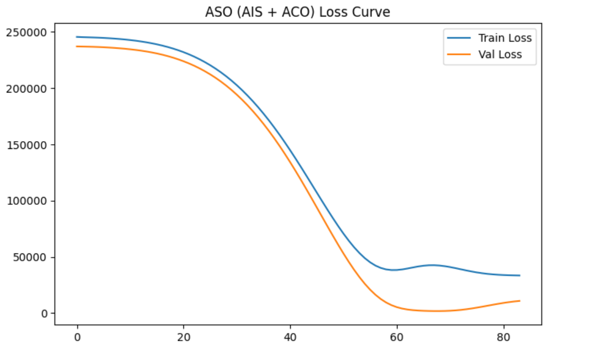

🏛️ Justice Delay Analytics for Senior Citizen Cases.
(Hybrid PSO–CSA Optimized Neural Network)
📌 Project Overview

Timely justice is critical for senior citizens, yet judicial delays remain a persistent challenge.
This project presents an AI-driven analytics and forecasting system to analyze and predict the disposal of senior citizen cases in the Karnataka High Court (Bengaluru).

A hybrid PSO–CSA (Particle Swarm Optimization + Crow Search Algorithm) is used to optimize neural network hyperparameters, improving prediction accuracy and convergence stability over traditional models.

🎯 Objectives

Analyze historical disposal trends of senior citizen cases

Detect temporal patterns across years and months

Predict future monthly case disposals

Visualize judicial efficiency using interpretable graphs

Demonstrate the effectiveness of hybrid metaheuristic optimization

🧠 Methodology
🔹 Data Processing

Cleaned and standardized government court data

Converted month names to numerical form

Normalized features using StandardScaler

🔹 Model Architecture

Multi-Layer Perceptron (MLP)

Input features:

Year

Month

Output:

Number of cases disposed

🔹 Hybrid Optimization Strategy (PSA)
Algorithm	Role
PSO	Global exploration of hyperparameter space
CSA	Memory-based refinement and exploitation
Hybrid PSA	Balanced convergence & robustness

Optimized Parameters:

Number of hidden neurons

Learning rate

📊 Visual Analytics

The system generates and displays the following visualizations:

Heatmap – Year × Month case disposal intensity

Training Loss Curve – Model convergence analysis

Actual vs Predicted Graph – Prediction accuracy

Future Forecast Graph – 12-month disposal projection

All graphs are shown during execution and saved automatically.

📁 Project Structure
Justice Delay Analytics for Senior Citizen Cases/
│
├── casesdisposedofseniorcitizenHCKBengaluru_3.csv
│
├── psa_pso_csa_justice_delay.py
│
├── psa_actual_vs_predicted.csv
├── psa_future_predictions.csv
│
├── psa_heatmap.png
├── psa_loss_curve.png
├── psa_actual_vs_predicted.png
├── psa_future_forecast.png
│
└── README.md

📄 Output Files
📊 CSV Outputs
File Name	Description
psa_actual_vs_predicted.csv	Test set comparison
psa_future_predictions.csv	12-month forecast
📈 Graph Outputs
File Name	Description
psa_heatmap.png	Case distribution heatmap
psa_loss_curve.png	Training & validation loss
psa_actual_vs_predicted.png	Model performance
psa_future_forecast.png	Forecast visualization
⚙️ Installation & Execution
1️⃣ Install Dependencies
pip install numpy pandas matplotlib seaborn scikit-learn tensorflow

2️⃣ Run the Model
python psa_pso_csa_justice_delay.py

During execution:

All graphs are displayed

Results are saved automatically in the project folder

📌 Key Results

Improved convergence stability using PSO–CSA hybrid

Robust predictions despite limited historical data

Clear interpretability through visual analytics

Suitable for policy analysis, judicial review, and academic research

🎓 Academic & Resume Use
🔹 Final-Year Project

This project demonstrates:

Metaheuristic optimization

Machine learning for public policy

Real-world government data handling

End-to-end ML deployment

🔹 Resume Line (Use This)

Developed a hybrid PSO–CSA optimized neural network to forecast senior citizen case disposals in the Karnataka High Court, integrating judicial analytics and predictive modeling.

🚀 Future Enhancements

Bench-wise and district-wise analysis

Confidence interval estimation

Streamlit-based interactive dashboard

Comparative study with GA, BA, ACO, AIS

Integration with real-time judicial APIs

📜 License

This project is intended for academic and research purposes.
Dataset credit belongs to the Karnataka High Court.
